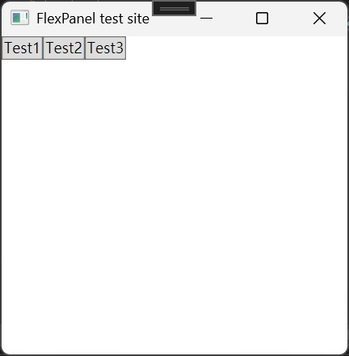
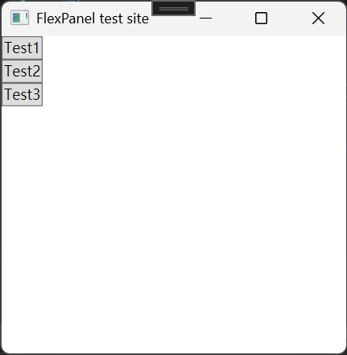

# QSoft.WPF.Panel 
## Quick start
1. install from [nuget](https://www.nuget.org/packages/QSoft.WPF.Panel)
2. add qpanel into xaml
```xml
<Window x:Class="WpfApp_FlexPanelT.MainWindow"
        xmlns="http://schemas.microsoft.com/winfx/2006/xaml/presentation"
        xmlns:x="http://schemas.microsoft.com/winfx/2006/xaml"
        xmlns:d="http://schemas.microsoft.com/expression/blend/2008"
        xmlns:mc="http://schemas.openxmlformats.org/markup-compatibility/2006"
        xmlns:local="clr-namespace:WpfApp_FlexPanelT"
        mc:Ignorable="d"
        xmlns:qpanel="clr-namespace:QSoft.WPF.Panel;assembly=QSoft.WPF.Panel"
        Title="FlexPanel test site" Height="450" Width="800">

        <qpanel:FlexPanel x:Name="flexpanel">
            <Button Width="100">Test1</Button>
            <Button Width="100">Test2</Button>
            <Button Width="100">Test3</Button>
        </qpanel:FlexPanel>

</Window>
```
## Direction: Row,Column
### Row
```xml
 <qpanel:FlexPanel FlexDirection="Row" x:Name="flexpanel">
    <Button>Test1</Button>
    <Button>Test2</Button>
    <Button>Test3</Button>
</qpanel:FlexPanel>
```

### Column
```xml
 <qpanel:FlexPanel FlexDirection="Column" x:Name="flexpanel">
    <Button>Test1</Button>
    <Button>Test2</Button>
    <Button>Test3</Button>
</qpanel:FlexPanel>
```



## FlexPanel
only support bleow property
* flex direction
* justify content
* align items, but no baseline
* align self, but no baseline
* padding and gap
* border properties
* Flex grow


## Refrences
[Flexbox Playground]("https://flexbox.tech/")


